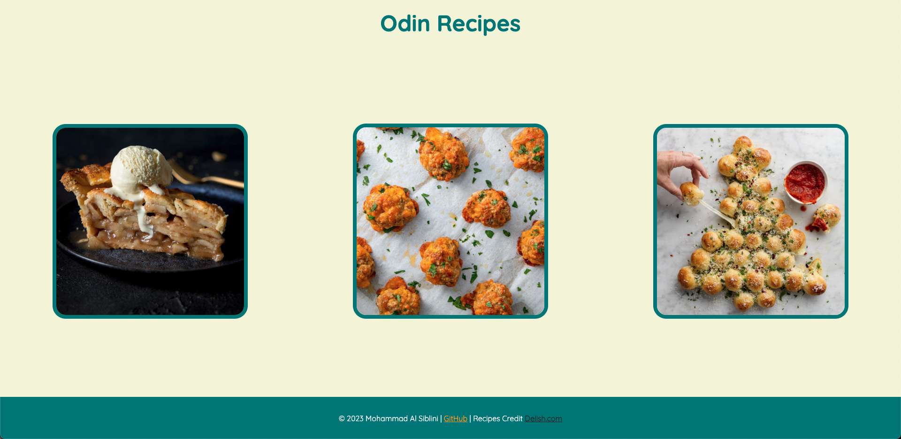
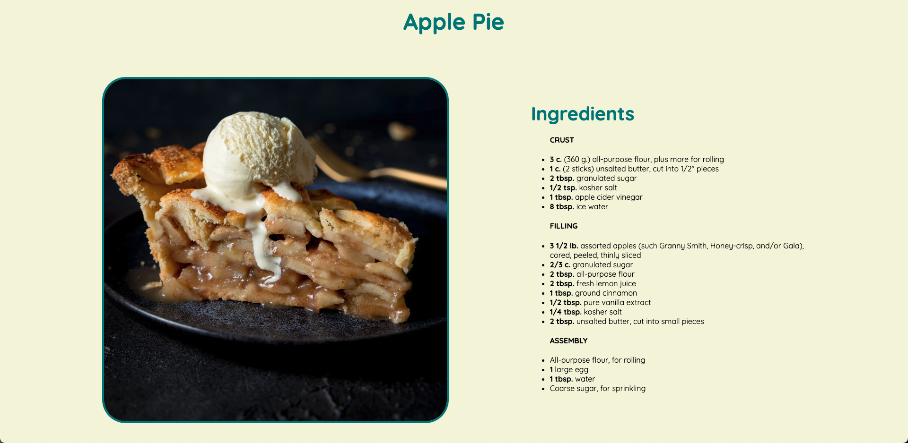

# Odin Recipes

## Description

This was a basic project from TOP that just needed basic HTML and CSS technology. However I tried to use some of what I know and learn more about what I can do

Recipes Credit: [Delish.com](https://Delish.com)

## Table of Contents

- [Demo](#demo)
- [Features](#features)
- [Technologies Used](#technologies-used)

## Demo

[Click Here To See The Hosted Site](https://mhmdlsiblini.github.io/odin-recipes/)

Some Screenshots from the Site:

## Features

- Media Query
- Transitions
- Simple Animation

## Technologies Used

- HTML
- CSS
- One Line of Javascript
